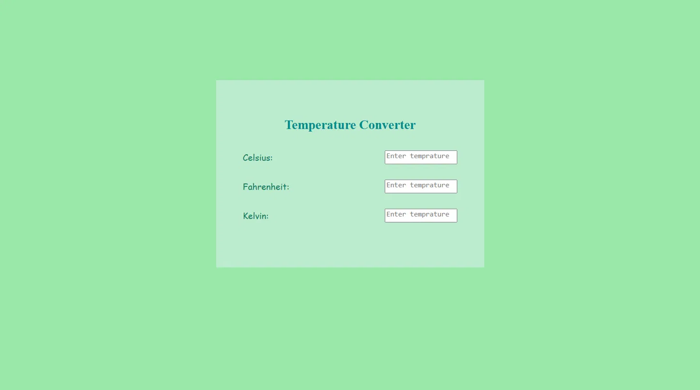

# Temperature-Converter

A simple temperature converter project built to strengthen my frontend fundamentals.

This project is created using HTML, CSS, and Vanilla JavaScript.
The same project will also be rebuilt using React to practice component-based development and move towards the MERN stack.

## Live Demo
🔗 [View Deployed Site](https://your-deployed-link-here.com)

## Preview

## Tech Stack
* HTML
* CSS
* JavaScript (Vanilla JS)

## Features
* Convert between Celsius, Fahrenheit, and Kelvin
* Clean, minimal UI
* Real-time input handling
* Responsive layout

## Purpose
This project is part of my learning journey to understand the fundamentals of frontend development before moving deeper into React and MERN stack development.

## Future Improvements
* Add input validation
* Auto-convert as you type
* Add unit toggle buttons
* Rebuild using React

Made with ❤️ while learning frontend development.
